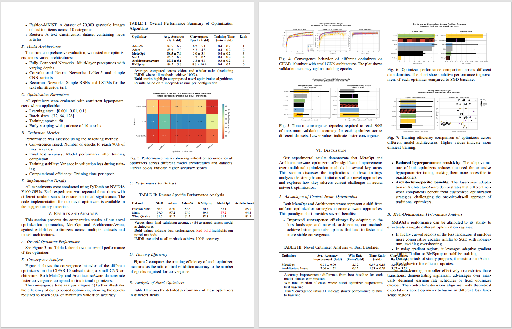
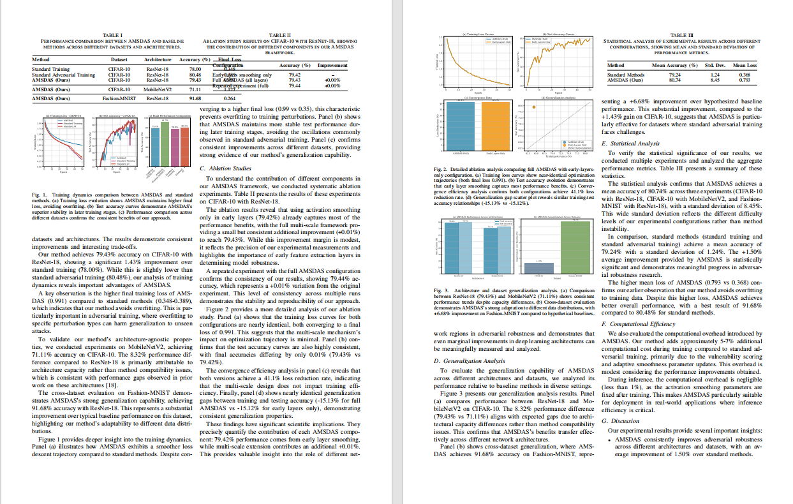

<div align="center">
  

  <h1>MLA V3 - 打造专属领域的 SOTA 级智能体</h1>

  <p>
    
    
    
  </p>

  <p>
    <a href="README.md">English</a> | <a href="README_CN.md">简体中文</a>
  </p>
</div>

---

## 🌟 简介

**infiAgent 也称为 MLA (Multi-Level Agent，多层级智能体)** 是一个专为**无限时长运行**设计的智能体框架，不会因为任务资源累积和对话历史增长而导致工具调用混乱或系统崩溃。使用 MLA，你只需编写配置文件即可构建强大的通用或半专业化智能体。

### 核心特性

- ✅ **无限时长运行**：不会因上下文累积而性能下降
- ✅ **多层级智能体架构**：基于树形结构的串行执行和编排
- ✅ **零上下文压缩**：基于文件的状态管理，无需上下文压缩
- ✅ **任务记忆**：使用工作空间作为任务 ID，跨会话持久化记忆
- ✅ **完整研究工作流**：从文献搜索到实验、绘图和 LaTeX 论文

### 默认配置

本仓库的默认配置是一个**面向研究的半专业化智能体**，能够：

- 📝 **学术论文写作**：从研究到 LaTeX 提交的完整端到端工作流
- ✅ **人类水平质量**：论文可通过 EI/IEEE 会议的人工评审
- 🧪 **科学计算**：ECM 蛋白质配比仿真、物流排班、作业批改等
- 🔬 **完整研究流程**：文献收集、实验设计、图表生成和论文撰写

### 动态

如果你在最新更新日期前拉取镜像或者代码，请参考修复的问题，重新拉取镜像和代码。

- [2026/01/06] Web UI：新增入口智能体选择功能，可在 Task ID 左侧选择作为对话入口的智能体，并在同一界面展示该智能体为根的 agent tree。

- [2026/01/05] 解决网络死锁问题（首token 卡死） ！重要更新！建议更新最新镜像或者拉取代码！

- [2026/01/04] 支持智能体基于用户回复输出不同交互语言，

- [2026/01/03] 优化 litellm 原生重试机制，通过提醒调用错误增加小模型调用成功率；增加链接超时检测机制，减少任务中断可能性。

- [2026/01/02] 上传了视频教程，点击：<a href="https://www.bilibili.com/video/BV142vQB2EDu/?share_source=copy_web&vd_source=8f099df5d40b73e936381e57d7fc05aa
">infiagent:全自动写作工具</a>

- [2026/01/02] 修复了文献管理工具的部分 bug，请更新最新代码或者拉取最近镜像 chenglinhku/mlav3

- [2026/01/01] 现已支持web ui多用户模式。拉取最新镜像网chenglinhku/mlav3进行体验，webui目前属测试阶段存在不稳定因素，最新镜像同时接收cli模式，详见quickstart教程

- [2026/01/01] 现已支持阿里云api包括qwen，适配绝大部分第三方中转站。配置详情请卡config文件夹对应的参考文件。

- [2025/12/31] 现在已支持 gemini api。重新拉取仓库，mla-tool-server restart，或者重新拉取 docker 即可生效。配置文件参考配置文件夹 gemini 开头的样板格式。

注意目前只支持 python 编程，早期版本execute_command只支持只读命令，目前已经支持所有命令（包括删除等危险命令），推荐在 docker 环境下使用。

---

## 🎬 输出

MLA完成的完整论文

**Demo 1:**

<p align="center">
  
</p>

**Demo 2:**

<p align="center">
  
</p>

**Demo 3:**

<p align="center">
  
</p>

MLA 处理整个研究工作流程——从文献搜索和实验设计到代码执行、图表生成和 LaTeX 论文撰写。全部通过多层级智能体自动编排完成。

---

## 📚 目录

- [输出](#-输出)
- [快速开始](#-快速开始)
- [工作原理](#-工作原理)
- [界面截图](#-界面截图)
- [配置指南](#-配置指南)
- [CLI 界面](#-cli-界面)
- [SDK 集成](#-sdk-集成)
- [示例输出](#-示例输出)

---

## 🚀 快速开始

### dock版视频演示教程

<a href="https://www.bilibili.com/video/BV142vQB2EDu/?share_source=copy_web&vd_source=8f099df5d40b73e936381e57d7fc05aa
">infiagent:全自动写作工具</a>

### 方式 1: Docker（推荐 - 无需 Python）

**1. 安装 Docker**
- Mac/Windows: [Docker Desktop](https://www.docker.com/products/docker-desktop)
- Linux: `curl -fsSL https://get.docker.com | sh`

**2. 拉取镜像**

```bash
docker pull chenglinhku/mlav3:latest
```

**3. 选择模式**

### 方式 A: Web UI 模式（推荐）

```bash
cd /你的工作空间
# XXXX 为可选端口，用于 agent 开发网页时暴露端口（如 5002）
docker run -d --name mla \
  -e HOST_PWD=$(pwd) \
  -v $(pwd):/workspace$(pwd) \
  -v ~/.mla_v3:/root/mla_v3 \
  -v mla-config:/mla_config \
  -p 8002:8002 \
  -p 9641:9641 \
  -p 4242:4242 \
  -p 5002:5002 \
  chenglinhku/mlav3:latest webui && docker logs -f mla
```

打开浏览器：http://localhost:9641 设置配置文件
然后打开浏览器：`http://localhost:4242`

默认用户名 user
默认密码 password


<p align="center">
  
</p>
📖 **Web UI 使用与界面说明**：详见 [web_ui/README.md](web_ui/README.md)。
### 方式 B: CLI 模式

```bash
cd /你的工作空间
# XXXX 为可选端口，用于 agent 开发网页时暴露端口（如 5002）
docker run -it --rm \
  -e HOST_PWD=$(pwd) \
  -v $(pwd):/workspace$(pwd) \
  -v ~/.mla_v3:/root/mla_v3 \
  -v mla-config:/mla_config \
  -p 8002:8002 \
  -p 9641:9641 \
  -p 5002:5002 \
  chenglinhku/mlav3:latest cli
```

**Windows 用户：**

Windows 用户建议使用 Docker。目前需要自己管理 conversation ID，不同的 conversation ID 维护不同的记忆。
如有 bug 欢迎提交 issue。

```powershell
# CLI 模式 (PowerShell)
docker run -it --rm `
  -e HOST_PWD="/{your_conversation_id}" `
  -v "${PWD}:/workspace/{your_conversation_id}" `
  -v "${HOME}\.mla_v3:/root/mla_v3" `
  -v mla-config:/mla_config `
  -p 8002:8002 `
  -p 9641:9641 `
  -p 5002:5002 `
  chenglinhku/mlav3:latest cli

# Web UI 模式 (PowerShell)
docker run -d --name mla-webui `
  -e HOST_PWD="/{your_conversation_id}" `
  -v "${PWD}:/workspace/{your_conversation_id}" `
  -v "${HOME}\.mla_v3:/root/mla_v3" `
  -v mla-config:/mla_config `
  -p 8002:8002 `
  -p 9641:9641 `
  -p 4242:4242 `
  -p 5002:5002 `
  chenglinhku/mlav3:latest webui

# 然后打开浏览器：http://localhost:4242
# 查看日志：docker logs -f mla-webui
```

**4. 配置 API Key**

打开浏览器：`http://localhost:9641`

<p align="center">
  
</p>

编辑 `run_env_config/llm_config.yaml`，填入 API key 并保存。

**🎉 完成！** 开始使用 MLA CLI。

📖 **[Docker 完整指南](docs/DOCKER_GUIDE.md)**

---

### 方式 2: 本地安装（需要 Python）

**1. 安装包**

```bash
# 确保 Python 版本 > 3.10
cd 安装路径
python -m venv venv
source venv/bin/activate  # Windows: venv\Scripts\activate
git clone https://github.com/ChenglinPoly/infiAgent.git
cd infiAgent
pip install -e .
```

**2. 安装 Playwright**

```bash
playwright install chromium
```

**3. 配置 API Key**

```bash
mla-agent --config-set api_key "your-api-key"
```

**4. 启动工具服务器**

```bash
mla-tool-server start
```

**5. 启动 CLI**

```bash
cd /你的工作空间
mla-agent --cli
```

📖 **[CLI 完整指南](docs/CLI_GUIDE.md)**

---

## 🎯 工作原理

MLA 的设计理念是**"为下一步提供简短但高价值的上下文"**。为实现这一理念，框架实现了多项创新：

### 1. 🌲 串行多智能体系统

MLA 在**树形层级结构**中部署智能体（例如，祖父 → 父亲 → 儿子）。这确保了：

- ✅ **单一目的智能体**：每个智能体都有专注的角色
- ✅ **最小工具集**：智能体仅访问必要的工具
- ✅ **任务对齐**：串行执行防止并行冲突
- ✅ **明确委派**：父智能体编排子智能体

**示例层级：**
```
alpha_agent（Level 3）
  ├── data_collection_agent（Level 2）
  │   └── web_search_agent（Level 1）
  ├── coder_agent（Level 2）
  └── material_to_document_agent（Level 2）
```

### 2. 🎯 嵌套注意力机制

长文档（PDF、小说、论文）**永远不会直接加载到上下文中**。相反：

- ✅ 使用 `answer_from_pdf`、`answer_from_document` 工具
- ✅ 查询驱动的内容提取
- ✅ 仅相关摘录或摘要进入上下文
- ✅ **应用层通过工具进行注意力分配**

**传统方法：**
```
加载整个 50 页 PDF → 智能体处理所有内容 → Token 溢出
```

**MLA 方法：**
```
智能体问："方法是什么？"
→ 工具提取相关部分（2 页）
→ 返回简洁答案 → 最小 token 使用
```

### 3. 📁 文件中心架构

**"文件即一切。"** 所有输出和交互都保存到文件系统：

- ✅ 网页抓取 → 保存为 Markdown 文件
- ✅ PDF 解析 → 提取到结构化文档
- ✅ 子智能体结果 → 存储为文件
- ✅ **无即时返回**使上下文混乱

**优势：**
- 清晰的审计跟踪
- 可重用的工件
- 无上下文状态表示

### 4. ⚡ 十步策略（无需上下文压缩）

一个关键洞察：**当前文件系统状态代表了所有历史操作的效果。**

- ✅ 一个独立的 **thinking 模块**每 10 步更新一次文件空间状态
- ✅ 智能体仅保留**最近 10 个操作**（自上次状态更新以来）
- ✅ **无需上下文压缩**
- ✅ 历史操作反映在文件系统中，而非对话历史

**传统 LLM 智能体：**
```
步骤 1：创建文件 A
步骤 2：编辑文件 B
...
步骤 100：上下文溢出 → 需要压缩 → 信息丢失
```

**MLA 方法：**
```
步骤 1-10：记录操作
步骤 10：Thinking 模块更新"当前状态：文件 A、B、C 存在，包含..."
步骤 11-20：仅保留这些 + 当前状态
→ 无压缩，无信息丢失
```

### 5. 🔧 批量文件操作

受 [Claude Code](https://www.anthropic.com/) 启发，MLA 使用**基于列表的工具参数**来节省 token：

- ✅ 一次调用读取多个文件
- ✅ 批量操作减少累积 token 消耗
- ✅ 重复操作显著节省 token

**示例：**
```python
# 传统：3 次单独调用
file_read(path="file1.txt")
file_read(path="file2.txt")
file_read(path="file3.txt")

# MLA：1 次批量调用
file_read(paths=["file1.txt", "file2.txt", "file3.txt"])
```

### 6. 💾 基于任务 ID 的长期记忆

- ✅ **任务 ID = 工作空间绝对路径**（用户不可配置）
- ✅ 同一任务 ID 下允许**无限对话会话**
- ✅ 智能体具有工作空间中所有历史任务的记忆
- ✅ 跨中断和重启的持久记忆

**使用：**
```bash
# 第一次会话
mla-agent --task_id ~/research --user_input "收集有关 Transformer 的论文"
# → 将对话存储在 ~/mla_v3/conversations/{hash}_research_*

# 第二次会话（几天后）
mla-agent --task_id ~/research --user_input "总结已收集的论文"
# → 智能体记住前一次会话并访问收集的文件
```

### 7. 📊 基于调用图的共享上下文

`hierarchy_manager` 维护**动态调用关系图**：

- ✅ 跟踪父子智能体关系
- ✅ 将调用图注入共享上下文
- ✅ 防止智能体越界
- ✅ 在多智能体系统中保持任务对齐

**调用图示例：**
```json
{
  "current_agent": "coder_agent",
  "parent": "alpha_agent",
  "siblings": ["data_collection_agent", "material_to_document_agent"],
  "allowed_tools": ["python_run", "file_write", "file_read"]
}
```

这确保 `coder_agent` 不会意外调用 `web_search`（不在其范围内）或干扰兄弟智能体。

---


## 📸 界面截图

### CLI 界面

MLA 提供了功能丰富的交互式 CLI，支持实时任务监控、HIL 处理和智能体切换：

**系统选择：**
<p align="center">
  
</p>

**工具模式配置：**
<p align="center">
  
</p>

**启动任务：**
<p align="center">
  
</p>

*基于 prompt_toolkit 和 rich 的交互式 CLI - 支持多轮对话、自动 HIL 检测和工具执行确认。*

### VS Code 插件

使用 MLA 的 JSONL 模式构建强大的 IDE 扩展：

<p align="center">
  
</p>

*由 MLA 驱动的 VS Code 扩展 - 与工作空间上下文无缝集成，支持实时流式输出。*

---

## ⚙️ 配置指南

MLA 使用 YAML 文件进行智能体和工具配置。配置文件位于：

```
config/
├── agent_library/
│   └── Default/                    # 默认智能体系统
│       ├── general_prompts.yaml    # 共享提示词
│       ├── level_-1_judge_agent.yaml  # 评判智能体
│       ├── level_0_tools.yaml      # 工具定义
│       ├── level_1_agents.yaml     # 底层智能体
│       ├── level_2_agents.yaml     # 中层智能体
│       └── level_3_agents.yaml     # 顶层智能体
└── run_env_config/
    ├── llm_config.yaml             # LLM 设置
    └── tool_config.yaml            # 工具服务器设置
```

### 关键配置文件

#### 1. `llm_config.yaml` - LLM 配置

```yaml
api_key: "your-api-key"
base_url: "https://openrouter.ai/api/v1"
models:
  - "openai/anthropic/claude-sonnet-4"
  - "openai/anthropic/claude-haiku-4.5"
temperature: 0.7
max_tokens: 8000
figure_models:
  - "google/gemini-2.0-flash-thinking-exp-01-21"
```

**注意**：复制 `llm_config.example.yaml` 到 `llm_config.yaml` 开始使用。

#### 2. 智能体层级

MLA 将智能体组织成层级：

- **Level 3**：顶层编排者（如 `alpha_agent`）
- **Level 2**：功能专家（如 `data_collection_agent`、`coder_agent`）
- **Level 1**：基础执行者（如 `web_search_agent`）
- **Level 0**：工具定义
- **Level -1**：质量控制（如 `judge_agent`）

#### 3. 创建自定义智能体

编辑 YAML 文件以自定义智能体行为：

```yaml
alpha_agent:
  type: llm_call_agent
  level: 3
  model_type: "advanced"
  available_tools:
    - data_collection_agent
    - coder_agent
    - data_to_figures_agent
    - material_to_document_agent
    - judge_agent
    - final_output
  system_prompt: |
    你是一个研究助手...
```

---

## 💻 CLI 界面

### 交互模式

启动 CLI 进行对话式体验：

```bash
mla-agent --cli
```

**主要功能：**

- 🔄 **多轮对话**，持久化上下文
- 🤖 **智能体切换**，使用 `@agent_name` 语法
- 🔔 **自动 HIL 检测**，带音频提醒
- ⚠️ **工具执行确认**，手动模式下
- ⏸️ **中断和恢复**支持（Ctrl+C 暂停）
- 🎨 **丰富的终端 UI**，基于 `prompt_toolkit` 和 `rich`

**使用示例：**

```bash
# 直接输入任务（使用默认智能体）
[alpha_agent] > 收集有关 Transformer 的论文

# 切换智能体并执行任务
[alpha_agent] > @data_collection_agent 搜索最近的 NLP 论文

# 仅切换默认智能体
[alpha_agent] > @coder_agent
✅ 已切换到：coder_agent
[coder_agent] > 
```

**CLI 命令：**

| 命令 | 描述 |
|------|------|
| `/help` | 显示帮助和可用命令 |
| `/agents` | 列出所有可用智能体 |
| `/resume` | 恢复中断的任务 |
| `/quit` 或 `/exit` | 退出 CLI 模式 |
| `Ctrl+C` | 中断当前任务（保持在 CLI 中） |
| `Ctrl+D` | 立即退出 CLI |

**人机交互（HIL）处理：**

当智能体请求人工输入时，CLI 会自动检测：

```
🔔🔔🔔 检测到 HIL 任务！按回车处理... 🔔🔔🔔
================================================================================
🔔 人类交互任务（HIL）
================================================================================
📝 任务 ID：upload_file_20250124
📋 指令：请上传所需的数据集文件...
================================================================================
💡 输入你的响应（任何文本）
   输入 /skip 跳过此任务
================================================================================

[alpha_agent] HIL 响应 > 文件已成功上传
✅ HIL 任务已响应
```

**工具确认（手动模式）：**

当设置 `--auto-mode false` 时，每次工具执行都需要确认：

```
⚠️⚠️⚠️ 检测到工具执行请求！按回车确认... ⚠️⚠️⚠️
================================================================================
⚠️  工具执行确认请求
================================================================================
🔧 工具名称：python_run
📝 确认 ID：confirm_12345
📋 参数：
     code: import numpy as np...
     timeout: 300
================================================================================
💡 选择操作：
   yes / y - 批准执行
   no / n  - 拒绝执行
================================================================================

[alpha_agent] 确认 [yes/no] > yes
✅ 已批准执行工具：python_run
```

---

### 命令行模式

用于脚本和自动化：

```bash
mla-agent \
  --task_id /path/to/workspace \
  --user_input "你的任务描述" \
  --agent_name alpha_agent
```

**常用参数：**

| 参数 | 描述 | 默认值 |
|------|------|--------|
| `--task_id` | 工作空间路径（绝对路径） | 必需 |
| `--user_input` | 任务描述 | 必需 |
| `--agent_name` | 调用的智能体 | `alpha_agent` |
| `--agent_system` | 智能体库名称 | `Default` |
| `--cli` | 交互式 CLI 模式 | `false` |
| `--jsonl` | JSONL 输出模式 | `false` |
| `--force-new` | 清空所有状态并重新开始 | `false` |
| `--auto-mode` | 工具执行模式（`true`/`false`） | 自动检测 |

**自动模式示例：**

```bash
# 自动执行工具（无需确认）
mla-agent --task_id ~/project --user_input "任务" --auto-mode true

# 每个工具需手动确认
mla-agent --task_id ~/project --user_input "任务" --auto-mode false
```

---

### 管理工具服务器

```bash
# 启动服务器（后台）
mla-tool-server start

# 检查状态
mla-tool-server status

# 停止服务器
mla-tool-server stop

# 重启服务器
mla-tool-server restart
```

---

## 🔌 SDK 集成

MLA 提供两种 SDK 选项：**Python SDK** 用于直接集成，**JSONL 模式**用于 IDE 插件。

---

### Python SDK

在你的 Python 代码中直接导入和使用 MLA 组件：

```python
from pathlib import Path
from utils.config_loader import ConfigLoader
from core.hierarchy_manager import get_hierarchy_manager
from core.agent_executor import AgentExecutor

# 初始化组件
task_id = str(Path.home() / "my_project")
agent_system = "Default"

config_loader = ConfigLoader(agent_system)
hierarchy_manager = get_hierarchy_manager(task_id)

# 获取智能体配置
agent_config = config_loader.get_tool_config("alpha_agent")

# 创建并运行智能体
agent = AgentExecutor(
    agent_name="alpha_agent",
    agent_config=agent_config,
    config_loader=config_loader,
    hierarchy_manager=hierarchy_manager
)

# 执行任务
result = agent.run(
    task_id=task_id,
    user_input="写一篇关于 Transformer 的综述论文"
)

print(f"状态：{result['status']}")
print(f"输出：{result['output']}")
```

**高级：自定义智能体与工具权限**

```python
# 设置工具执行模式
agent.tool_executor.set_task_permission(task_id, auto_mode=True)

# 使用自定义配置运行
result = agent.run(task_id, user_input)

if result['status'] == 'success':
    print("任务成功完成！")
else:
    print(f"错误：{result.get('error_information')}")
```

**Python SDK 使用场景：**
- 🔧 构建自定义工作流
- 🤖 在现有应用中嵌入智能体
- 📊 批量处理多个任务
- 🔬 程序化控制的研究实验

---

### JSONL 模式（IDE 插件）

MLA 提供 JSONL 流式模式，用于与 IDE 和编辑器实时集成：

```bash
mla-agent \
  --task_id $(pwd) \
  --user_input "优化代码性能" \
  --jsonl 2>/dev/null
```

**输出格式：**

```jsonl
{"type":"start","call_id":"c-1760936557-474c43","project":"~/project","agent":"alpha_agent","task":"优化..."}
{"type":"token","text":"[alpha_agent] 正在分析代码..."}
{"type":"progress","phase":"execution","pct":30}
{"type":"token","text":"调用工具：code_analyzer"}
{"type":"result","ok":true,"summary":"优化完成"}
{"type":"end","status":"ok","duration_ms":5432}
```

**事件类型：**

| 事件类型 | 描述 | 关键字段 |
|----------|------|----------|
| `start` | 任务开始 | `call_id`、`agent`、`task` |
| `token` | 流式文本输出 | `text` |
| `progress` | 进度更新 | `phase`、`pct` |
| `result` | 任务结果 | `ok`、`summary` |
| `end` | 任务完成 | `status`、`duration_ms` |
| `error` | 发生错误 | `message` |

---

### TypeScript/JavaScript 集成

```typescript
import { spawn } from 'child_process';

interface AgentEvent {
  type: 'start' | 'token' | 'progress' | 'result' | 'end' | 'error';
  [key: string]: any;
}

function runAgent(
  workspacePath: string, 
  userInput: string,
  onEvent: (event: AgentEvent) => void
): Promise<AgentEvent> {
  return new Promise((resolve, reject) => {
    const child = spawn('mla-agent', [
      '--task_id', workspacePath,
      '--user_input', userInput,
      '--jsonl'
    ]);
    
    let buffer = '';
    
    child.stdout.on('data', (data) => {
      buffer += data.toString();
      const lines = buffer.split('\n');
      buffer = lines.pop() || '';
      
      lines.forEach(line => {
        if (!line.trim()) return;
        
        try {
          const event: AgentEvent = JSON.parse(line);
          onEvent(event);
          
          if (event.type === 'end') {
            resolve(event);
          } else if (event.type === 'error') {
            reject(new Error(event.message));
          }
        } catch (e) {
          console.error('解析事件失败：', line);
        }
      });
    });
    
    child.stderr.on('data', (data) => {
      // 将错误记录到 stderr
      console.error(data.toString());
    });
    
    child.on('error', reject);
  });
}

// 使用示例
await runAgent('/path/to/workspace', '编写单元测试', (event) => {
  switch (event.type) {
    case 'start':
      console.log(`任务开始：${event.task}`);
      break;
    case 'token':
      process.stdout.write(event.text);
      break;
    case 'progress':
      updateProgressBar(event.pct);
      break;
    case 'result':
      console.log(`\n结果：${event.summary}`);
      break;
  }
});
```

---

### VS Code 扩展示例

使用 MLA 构建你自己的 Cursor/VS Code 扩展：

**扩展功能：**
- 🤖 命令面板中的智能体命令
- 💬 带工作空间上下文的内联聊天
- 📝 自动代码生成和重构
- 🔍 编辑器内文献搜索
- 🔔 带 UI 提示的 HIL 任务处理

**基本扩展结构：**

```typescript
// extension.ts
import * as vscode from 'vscode';
import { runAgent } from './mla-client';

export function activate(context: vscode.ExtensionContext) {
  let disposable = vscode.commands.registerCommand(
    'mla.executeTask', 
    async () => {
      const workspace = vscode.workspace.workspaceFolders?.[0].uri.fsPath;
      const input = await vscode.window.showInputBox({
        prompt: '输入任务描述'
      });
      
      if (!workspace || !input) return;
      
      // 显示进度
      await vscode.window.withProgress({
        location: vscode.ProgressLocation.Notification,
        title: 'MLA 智能体',
        cancellable: true
      }, async (progress, token) => {
        
        await runAgent(workspace, input, (event) => {
          if (event.type === 'token') {
            vscode.window.showInformationMessage(event.text);
          } else if (event.type === 'progress') {
            progress.report({ increment: event.pct });
          }
        });
      });
    }
  );
  
  context.subscriptions.push(disposable);
}
```

---

## 📊 示例输出

### 学术论文输出

MLA 可以生成具有以下结构的完整研究论文：

```
upload/
├── paper.tex               # 主 LaTeX 文档
├── references.bib          # 参考文献
├── figures/
│   ├── architecture.png
│   ├── results_comparison.png
│   └── ablation_study.png
└── supplementary/
    └── detailed_results.pdf
```

**质量指标：**
- ✅ 通过 EI/IEEE 会议的同行评审
- ✅ 正确的引用格式
- ✅ 高质量图表（300 DPI）
- ✅ 连贯的结构和流程

### 其他能力

**1. 科学计算**
- ECM 蛋白质组成仿真
- 物流公司排班调度
- 学生作业批改与反馈

**2. 通用任务**
- 网页抓取和数据提取
- 代码生成和调试
- 文档转换和处理

---


## 📖 文档

- [工具服务器 API 文档](tool_server_lite/README.md) - 18 个可用工具
- [人机交互 API](tool_server_lite/HIL_API.md) - 用户交互集成
- [配置示例](config/agent_library/Default/) - 智能体 YAML 模板

---

## 🤝 贡献

欢迎贡献！请随时提交问题或拉取请求。

---

## 📄 许可证

详见 [LICENSE](LICENSE)

---

## 📄 引用

如果您在研究中使用了 InfiAgent，请引用我们的论文：

```bibtex
@article{yu2026infiagent,
  title={InfiAgent: An Infinite-Horizon Framework for General-Purpose Autonomous Agents},
  author={Yu, Chenglin and Wang, Yuchen and Wang, Songmiao and Yang, Hongxia and Li, Ming},
  journal={arXiv preprint arXiv:2601.03204},
  year={2026}
}
```

---

## 🙏 致谢

- 使用 [LiteLLM](https://github.com/BerriAI/litellm) 统一 LLM 访问
- 使用 [Crawl4AI](https://github.com/unclecode/crawl4ai) 进行网页抓取

---

## 📬 联系方式

**作者**：@yuchenglin

**感谢贡献者**：@wangyuchen @wangsongmiao @yuyang @lijinjia

**邮箱**：yuchenglin96@qq.com/cl0415@connect.hku.hk/chenglin.yu@poly.edu.h 

**GitHub**：[MLA V3 仓库](https://github.com/ChenglinPoly/infiAgent)

---

**使用 MLA V3 开始构建专属领域的 SOTA 智能体！** 🚀

